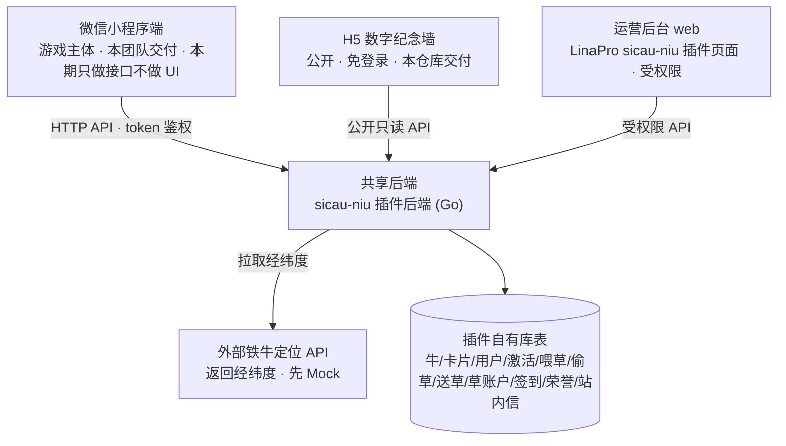
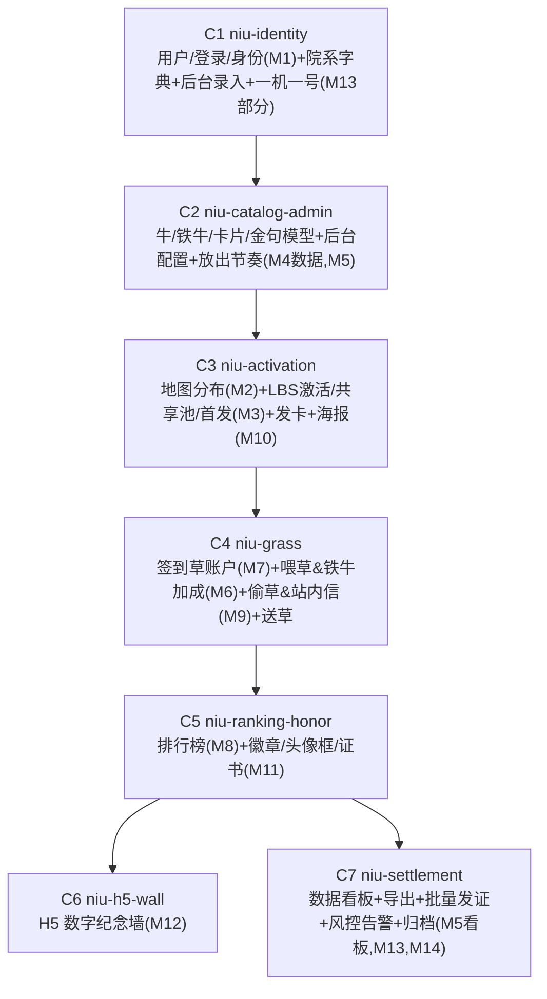

# sicau-niu 寻牛活动 · 总体设计（Program Design）

> 本文是**程序级总体设计**，覆盖整个寻牛活动在 LinaPro `sicau-niu` 插件中的落地范围、架构、领域模型、技术决策与 change 切分。
> 单个 OpenSpec change 的细化设计仍各自落在 `openspec/changes/<change>/design.md`。
> 需求事实来源：同目录 `需求.md` 的「最终确定的完整功能」15 个模块；上方活动策划仅作背景。

## 1. 背景与定位

川农 120 周年校庆「寻牛」活动：以「川农牛」为载体把校史/精神/人物/科研以**卡片**嵌入 LBS 游戏，玩家在校园内**发现牛 → 激活牛 → 收集卡片 → 喂草/偷草/送草**，兼顾收藏、传播、教育。全校 120 头牛**共享池**（任一人激活后全员可见），手机号注册面向所有人。

在 LinaPro 框架中，本项目作为 `sicau-niu` 源码插件交付，定位为一个**完整业务能力域**，而非最小示例。

## 2. 锁定范围

| 状态 | 内容 |
|------|------|
| ✅ 做 | M1 登录身份 · M2 地图分布 · M3 LBS 激活（共享池/首发） · M4 卡片图鉴 · M5 运营后台+看板 · M6 喂草（含铁牛 `×1.5` 加成） · M7 签到草账户 · M8 排行榜 · M9 偷草 · M10 激活海报 · M11 徽章/头像框/证书 · M12 H5 纪念墙 · M13 风控 · M14 公示结算 · M15 测试运维 · **送草**（赠送指定玩家草量，归入 C4 草能力域） |
| ❌ 不做 | 牛皮肤动画 · 校友捐赠与冠名（须独立立项） |

## 3. 总体架构

三个前端表面，共享一个后端；后端即 `sicau-niu` 插件后端，运营后台即插件的 LinaPro 前端页面。H5 纪念墙在本仓库交付。铁牛经纬度由后端**拉取外部定位 API**（先 Mock）。



**交付边界说明**：微信小程序 App 由本团队交付（独立小程序代码库），**本期先实现面向小程序的后端 API，不实现小程序 UI**。本仓库 `sicau-niu` 插件负责：小程序**后端 API 契约**、**运营后台页面**、**H5 纪念墙**。

## 4. 领域模型

```mermaid
erDiagram
  USER ||--o{ ACTIVATION : 激活
  USER ||--o{ FEEDING : 喂草
  USER ||--o{ STEAL : 偷草
  USER ||--o{ GIFT : 送草
  USER ||--|| GRASS_ACCOUNT : 拥有
  USER ||--o{ GRASS_TXN : 流水
  USER ||--o{ CHECKIN : 签到
  USER ||--o{ USER_HONOR : 获得
  USER ||--o{ INBOX_MSG : 站内信
  NIU ||--|| CARD : 关联主卡
  NIU ||--o{ ACTIVATION : 被激活
  NIU ||--o{ FEEDING : 被喂
  IRON_NIU ||--o{ NIU : 加成范围(直线<12m)
  QUOTE }o--o{ NIU : 随机金句池
  HONOR ||--o{ USER_HONOR : 定义
```

关键实体与字段要点：

| 实体 | 关键字段 | 说明 |
|------|---------|------|
| `Niu` 牛 | 序号、类型（普通/特殊）、特殊子类（学院/贡献/校友/精神）、名称、关联院系、GPS 经纬、上线阶段、上线规则（日期/时段）、关联卡片、状态、首发用户、激活序号 | 共享池；状态全员可见；锚点固定 |
| `IronNiu` 铁牛 | 铁牛标识、最近经纬、最近拉取时间 | 经纬度由后端从外部定位 API 拉取（可 Mock）；与虚拟牛**直线距离 `<12m`** 时该牛喂草加成 |
| `Card` 卡片 | 分类（人物/事件/科研/院系/精神）、标题、文案、图片、`niuId(1:1)` | 1 牛 1 卡 |
| `Quote` 校史金句 | 文案 | 喂草/点击随机播放 |
| `User` 用户 | openid、手机号、昵称、身份类型（在校生/校友/川农好友）、院系（字典）、年级（用户填数字）、毕业年（校友填数字）、设备指纹 | 手机号一机一号；**不再从学号自动带出院系/年级** |
| `Activation` 激活记录 | 用户、牛、时间、是否首发、到场序号 | 每人每日 1 次 |
| `Feeding` 喂草记录 | 用户、牛、**原始投喂量**、**加成系数(默认1.5)**、**实际效果**、是否铁牛加成、时间 | 无地理限制；铁牛范围内实时加成 |
| `Steal` 偷草记录 | 发起人、目标人、草量、时间 | 每日随机 12 人可偷 |
| `Gift` 送草记录 | 赠送人、接收人、草量、时间 | 主动赠送指定玩家，双方账户事务化记账 |
| `GrassAccount`/`GrassTxn` 草账户/流水 | 余额；流水（签到+/喂草−/偷草+/被偷−/送出−/收到+） | 账本式记账，余额可追溯 |
| `Checkin` 签到 | 用户、日期、草量(20–50) | 每日 1 次 |
| `InboxMsg` 站内信 | 用户、类型、内容、已读 | 被偷、收到赠草等通知走站内信 |
| `Honor`/`UserHonor` 荣誉 | 类型（参与徽章/分类徽章/头像框/证书）、解锁条件 | 配置 + 发放 |

> 图鉴、排行榜、纪念墙均为**派生数据**（由激活/喂草/首发聚合而来），不单独建权威表，按性能需要做预聚合或快照。

## 5. 模块 → 端 → 能力 映射

| # | 模块 | 小程序端(接口) | 运营后台 | H5 | 共享后端核心 |
|---|------|:---:|:---:|:---:|------|
| 1 | 登录与身份 | ● | ○(院系字典录入) | | 微信登录换 token、用户建档、身份校验（院系字典/年级数字） |
| 2 | 地图与牛分布 | ● | | | 可见牛列表（按节奏过滤）、状态投影 |
| 3 | 激活核心 | ● | | | LBS 判距（无图像识别）、每日限次、首发并发判定、状态广播 |
| 4 | 卡片图鉴 | ● | ○(内容配置) | | 发卡、图鉴聚合 |
| 5 | 后台管理+看板 | | ● | | 牛/铁牛/卡片/节奏/院系字典 CRUD、看板预聚合 |
| 6 | 喂草（含铁牛加成） | ● | ○(铁牛配置) | | 喂草记账、随机金句、轨迹、**铁牛直线 `<12m` 实时 ×1.5（记原始量+系数）** |
| 7 | 签到/草账户/送草 | ● | | | 签到发草、账本记账、余额、**送草（赠送指定玩家）** |
| 8 | 排行榜 | ●(展示) | ○(查看) | | 三榜聚合（按身份标签） |
| 9 | 偷草 | ● | | | 随机名单、偷草记账、限次、**被偷站内信通知** |
| 10 | 激活海报 | ●(数据/分享) | | | 按**设计稿服务端出图**、序号/数据下发 |
| 11 | 徽章/头像框/证书 | ●(展示/解锁) | ●(配置/批量发) | | 解锁判定、批量发放 |
| 12 | H5 纪念墙 | | ○(定稿) | ● | 公开只读聚合（首发 120 人等） |
| 13 | 风控 | | ●(告警视图) | | 一机一号、定位防造假、异常限频/告警 |
| 14 | 公示/结算 | | ● | | 导出、批量发证、归档 |
| 15 | 测试与上线运维 | 横切 | 横切 | 横切 | 功能/兼容/性能/风控测试、审核/灰度/监控 |

（● 主要承载，○ 次要/部分；本期小程序仅交付接口，UI 后续）

## 6. 关键技术决策（已确认）

| 主题 | 决策 |
|------|------|
| 激活判定 | **不做图像识别**，仅服务端 LBS 判距（Haversine + 阈值）；拍照仅作仪式/取证 |
| 首发并发一致性 | 牛状态 `未激活→已激活` 原子化（唯一约束/行锁 + 事务），首发用户与激活序号同事务内确定 |
| 状态全员可见 | 激活后刷新/失效牛状态缓存或快照，遵循 `cache-consistency`；集群下用宿主统一协调机制 |
| 每日限次 | 激活/签到/偷草均按「用户+自然日」计数，配唯一约束兜底 |
| 草账户 | **账本式记账**（流水 + 余额），所有增减事务化，可对账可结算 |
| 排行榜/看板 | **预聚合 + 缓存/快照**，避免每次请求全表聚合，杜绝 N+1 |
| 激活海报 | **有设计稿**，按设计稿**服务端出图（PNG）**，统一样式可追溯 |
| 被偷/收草通知 | 走**站内信**（`InboxMsg`），不依赖微信订阅消息 |
| 身份信息 | 院系=**后台维护字典 + 用户选择**（后台提供录入入口，后续手动录入）；年级=**用户填数字**；不再从学号自动带出 |
| 铁牛定位 | 后端通过**一个外部 API 获取铁牛经纬度**，**先用 Mock 实现**，后续替换为真实接口 |
| 铁牛加成 | 用户喂草时**实时生效**；喂草记录保存**原始投喂量 + 加成系数 + 实际效果**；加成系数为**集中定义的常量（默认 1.5）**，便于后续直接修改 |
| 送草 | 用户可将自有草量**赠送指定玩家**，双方账户事务化记账，接收方站内信通知；**每人每天最多送 12 次，每次至少 12 份草**（次数/单次下限为集中常量，余额不足拒绝） |
| 偷草名单 | 每日为每用户随机抽 12 个可偷目标 + 每日偷次上限；随机化避免社交骚扰 |
| 风控 | 手机号唯一 + 设备指纹 + 定位跳变/速度检测 + 异常限频告警（轻量级） |
| 小程序交付 | App 由本团队交付；**本期先实现面向小程序的后端 API，不实现小程序 UI** |
| 多租户 | **不涉及多租户**：插件 `scope_nature=platform_only`、`supports_multi_tenant=false`、`default_install_mode=global` |
| i18n | **单语言（中文），不启用**；`plugin.yaml` 不含 i18n 块 |
| H5 纪念墙 | 在**本仓库**交付（插件前端静态资源 / 公开路由） |

### 铁牛加成关键设计点

- **位置获取**：后端封装一个「铁牛定位」能力，调用外部 API 返回 `铁牛标识 + 经纬度`；本期以 **Mock 实现**（返回可配置的固定/模拟坐标），接口边界稳定，后续直接替换真实实现。
- **加成判定**：用户喂草时取**目标牛固定锚点**与**各铁牛当前经纬**的**直线距离（Haversine 大圆距离）**，`<12m` 即触发加成（任一铁牛命中即生效）。
- **加成记账**：喂草记录写入 `原始投喂量`、`加成系数`、`实际效果(=原始×系数)`、`是否铁牛加成`；系数取自集中常量（默认 `1.5`），修改一处即全局生效。
- **加成对象**：作用于喂草「实际效果」，并据此计入用户喂草量统计与榜单计分。

## 7. Change 切分（OpenSpec 落地计划）

按能力与依赖顺序拆为 7 个 change，每个自带「API 契约 + 后台页面 + 后端实现 + 测试」，粒度独立可审查。`M15` 融入每个 change 的 tasks/testing。



| Change | 覆盖模块 | 核心交付物 |
|--------|---------|-----------|
| `niu-identity` | M1, M13(一机一号) | 登录/身份 API、用户表、身份字典、**院系字典 + 后台录入入口**、手机号唯一；插件改为 `platform_only` |
| `niu-catalog-admin` | M4(数据), M5 | 牛/铁牛/卡片/金句表与后台 CRUD、放出节奏配置、铁牛标识登记、看板雏形 |
| `niu-activation` | M2, M3, M4(运行), M10 | 可见牛列表、LBS 激活、首发并发、发卡、海报出图 |
| `niu-grass` | M6, M7, M9, 送草 | 草账户账本、签到、喂草、**铁牛定位(Mock)+加成判定/记账**、偷草、**送草**、被偷/收草站内信 |
| `niu-ranking-honor` | M8, M11 | 三榜聚合、荣誉配置/解锁/发放 |
| `niu-h5-wall` | M12 | H5 纪念墙公开页 + 回跳 |
| `niu-settlement` | M5(看板), M13(告警), M14 | 数据看板、导出、批量发证、风控告警视图、归档 |

## 8. 横切关注点（设计门禁对齐）

| 维度 | 设计结论 |
|------|---------|
| 多租户 | **不涉及**；`scope_nature=platform_only`、`supports_multi_tenant=false`、`default_install_mode=global`（当前脚手架为 `tenant_aware`，**C1 调整**） |
| 字典枚举 | 身份类型、院系、牛类型/子类、卡片分类、活动阶段、草账户流水类型、荣誉类型、站内信类型均走**字典治理**，禁止硬编码枚举字符串；铁牛加成系数为代码内集中常量（非枚举） |
| i18n | **单语言（中文），不启用 i18n**；各 change 须记录「无 i18n 影响」 |
| 数据权限 | 小程序用户只能读写**自己**的草账户/激活/喂草/偷草/送草/站内信；牛、卡片、榜单为公开读；运营后台为受权限的全量数据；铁牛定位为后端**拉取**外部 API（Mock），无对外写入 |
| 接口性能 | 地图牛列表（≤120，批量投影）、三榜（预聚合/缓存）、看板（预聚合）、铁牛加成（按当前坐标计算，铁牛数量为小常量）、导出（分批）均须有界，杜绝 N+1 与前端瀑布式补查 |
| 接口契约 | RESTful；时间点字段统一返回 **Unix 毫秒** `int64` |
| 缓存一致性 | 牛状态、榜单快照涉及缓存；集群下用宿主统一 `cluster/coordination` 机制，遵循 `cache-consistency` |
| 测试运维(M15) | 各 change 覆盖单测/编译门禁；用户可观察行为补 E2E；小程序多机型/多微信版本、审核/灰度/监控属交付期工程项 |

## 9. 待确认问题

1. **铁牛定位外部 API 形态**：真实接口的入参/出参与鉴权（Mock 阶段不阻塞；定真实接口前需对齐契约）。
2. 院系字典初始清单来源（学校官方院系名单，用于首次手动录入）。

## 10. 不在本期范围

牛皮肤动画、校友捐赠与冠名系统（须由校友会/基金会独立立项，本项目至多提供冠名展示接口）。
